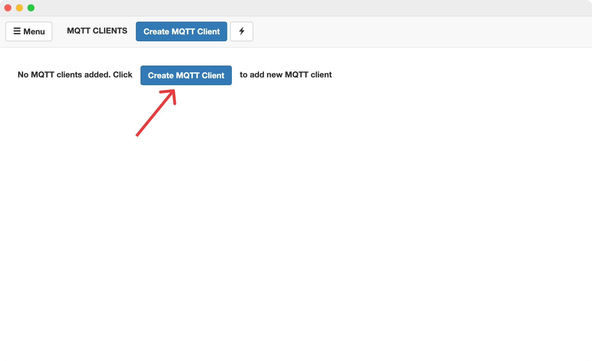
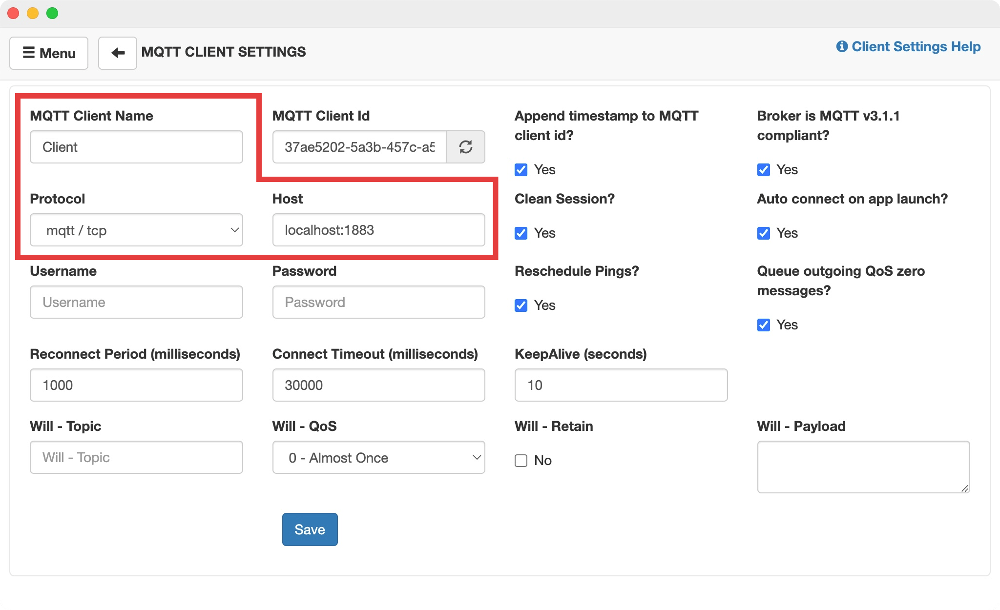
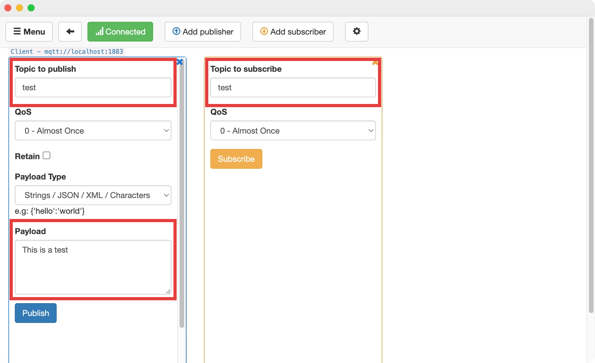
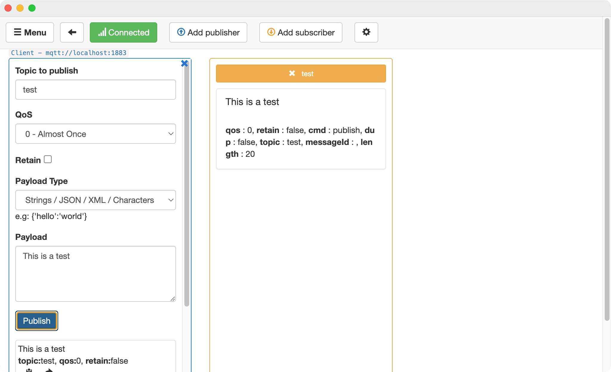

# MQTT Server/Broker Example

As part of Bitovi's Introduction to MQTT article, this repo allows you to run an `aedes` MQTT broker.  To start the server:

- `npm i`
- `npm start`

## Trying Out the Server

You can use the [MQTT Box Chrome App](https://chrome.google.com/webstore/detail/mqttbox/kaajoficamnjijhkeomgfljpicifbkaf/related) to subscribe to and publish messages.

### Create an MQTT Client

Once you've installed and opened MQTT Box, you should see the option to create an MQTT client. If not, navigate to "Clients" in the menu.  Click the "Create MQTT Client" button:

You'll be presented with the below form for creating a client.  There are three values which need to be filled in, as shown in the form, below.

- MQTT Client Name: `Client` (or any value, really)
- Protocol: `mqtt/tcp` (we didn't enable other options)
- Host: `localhost:1883` (to match the port on the server)

Don't forget to save. ;)

### Subscribing and Publishing

Once you've created an MQTT client, you'll see a blue-bordered pane on the left titled "Topic to publish" and an orange-bordered pane on the right called "Topic to subscribe":

You *could* fill in the topic on the publish side and start publishing, but you won't see anything happen after you subscribe. To witness the UI changing, you need to create a subscriber, first.  Fill in the topic on the subscriber and press the "Subscribe" button. Now you can fill in the payload field on the publish side and hit "Publish".  And voila! The UI for the Subscriber will update with the message contents:

